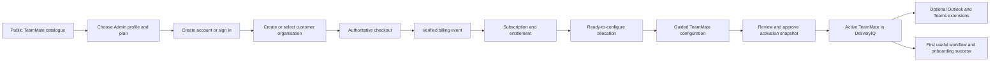

# DIQ-401 — TeamMate Commerce, Provisioning and Delivery Framework

| Control            | Value                                                                                                              |
| ------------------ | ------------------------------------------------------------------------------------------------------------------ |
| Document ID        | DIQ-401                                                                                                            |
| Version            | 1.0-RC2                                                                                                            |
| Status             | **PRODUCT OWNER APPROVED — COMMERCIAL DECISIONS AND FINAL APPROVAL PENDING**                                       |
| Owner              | Product Owner                                                                                                      |
| Subject owner      | TeamMate Commerce and Customer Operations                                                                          |
| Product approval   | Product Owner, 2 August 2026                                                                                       |
| Final approver     | Matt Prust                                                                                                         |
| Architecture       | [DIQ-002 Product Architecture](<../../00-master-index/DIQ-002 Product Architecture.md>)                            |
| TeamMate framework | [DIQ-400 v1.0-RC3](<DIQ-400 TeamMate Framework.md>)                                                                |
| Reference type     | [TM-001 Admin TeamMate v1.0-RC2](<admin/TM-001 Admin TeamMate.md>)                                                 |
| Reference profile  | [TM-001P-001 Delivery Operations](<admin/profiles/delivery-operations/TM-001P-001 Delivery Operations Profile.md>) |
| Machine contract   | [DIQ-401A](<configuration/DIQ-401A TeamMate Commerce and Fulfilment Contract.json>)                                |
| Golden fixtures    | [DIQ-401B](<configuration/DIQ-401B TeamMate Commerce and Fulfilment Golden Fixtures.json>)                         |
| Classification     | Internal — Controlled                                                                                              |

> **Approval boundary.** This document approves the target purchase-to-value operating model and the separation of commerce, entitlement, provisioning and TeamMate activation. It does not approve prices, taxes, currencies, trial length, payment-failure grace, cancellation retention, a payment provider, marketplace publication, external production credentials or application implementation. The decisions in Section 27 require Matt Prust’s approval before this package can be promoted to version 1.0 and **LOCKED**.

## 1. Executive Definition

DeliveryIQ TeamMates are delivered as a subscription software service, not as a downloadable agent, model or executable. A customer chooses a TeamMate offer on the DeliveryIQ website, creates or joins a verified customer organisation, completes an approved checkout, receives a tenant-scoped entitlement, and is taken into guided configuration. DeliveryIQ creates the runtime TeamMate instance only after an authorised owner separately approves its scope, capabilities, data, memory, schedules, integrations and consent.

The primary product is available immediately in DeliveryIQ. Outlook and Teams experiences are optional governed extensions of the same instance and may require user installation or Microsoft 365 administrator deployment.

**Customer promise:** _Choose the administrative colleague and work profile your SME needs, subscribe with confidence, and be guided from purchase to useful work without software installation or hidden activation._

## 2. Product Principles

1. **Purchase is not activation.** A completed checkout grants an entitlement/allocation; it never creates memory, runs a workflow or accesses customer data.
2. **DeliveryIQ is the product home.** Microsoft and other clients extend the same service; they do not contain independent TeamMates.
3. **Fulfilment is immediate where safe.** A successful verified subscription should produce a ready-to-configure allocation without manual operations for eligible self-service customers.
4. **Commercial and security states are separate.** Discoverability, purchasability, payment, subscription, entitlement, provisioning, permission, consent and activation are evaluated independently.
5. **The server is authoritative.** Browser return URLs, client flags and email links never prove payment or entitlement.
6. **Premium starts with onboarding.** The post-checkout experience reaches a useful first workflow; it is not a receipt page followed by an empty dashboard.
7. **Enterprise deployment is managed.** SSO, data terms, tenant approval, Microsoft deployment and pilot rollout are treated as a customer-success journey, not a larger self-service basket.
8. **Cancellation is not destructive.** Access changes safely while customer records, audit and export/retention obligations remain governed.
9. **No card data in DeliveryIQ.** A certified payment provider owns sensitive payment collection and storage.
10. **Every commercial side effect is reconciled.** Checkout, billing events, entitlements and provisioning have immutable identifiers, idempotency and operational recovery.

## 3. What Is Being Sold and Shipped

### 3.1 Commercial unit

A TeamMate offer binds:

- one stable TeamMate product/type identity;
- a customer-facing plan/tier;
- an approved type/version eligibility policy;
- one or more approved compatible work-profile/version options and optional industry-overlay eligibility;
- an instance/allocation allowance;
- an included collaborator/user allowance;
- included channels, workflows, integrations and service features;
- usage/fair-use or metering policy where applicable;
- billing interval, currency, tax treatment and price;
- availability by market, region and customer segment;
- trial, promotion, renewal, cancellation and support policy;
- a fulfilment profile and required onboarding journey.

Exact prices, allowances and commercial values are versioned catalogue configuration, not hard-coded application behaviour.

### 3.2 Shipping unit

The customer does not receive the TeamMate’s prompt, model, manifest or software package. DeliveryIQ fulfils:

1. a subscription/order record;
2. a tenant-scoped entitlement with an available TeamMate allocation;
3. an authenticated DeliveryIQ organisation/workspace;
4. a **ready to configure** onboarding route;
5. after separate activation approval, a pinned TeamMate instance and work queue;
6. the selected profile/optional overlay and customer configuration pinned to that instance;
7. optional links or admin instructions for Outlook and Teams extensions;
8. onboarding, help, service status and billing-management access.

The same TeamMate identity, policy, memory and history follows the customer across DeliveryIQ, Outlook and Teams.

## 4. End-to-End Customer Journey

### 4.1 Website discovery

An unauthenticated visitor may:

- browse the safe TeamMate catalogue;
- compare supported outcomes, who each TeamMate helps and what it does/does not do;
- compare available work profiles without implying a separate runtime for each industry;
- view plan features, current approved pricing, billing interval and applicable tax disclosure;
- see integration requirements, data/privacy summary, support and service expectations;
- view an interactive demo or approved sample output;
- select **Start**, **Subscribe** or **Contact sales** according to the offer.

The website never claims a TeamMate can perform an unapproved capability. Unavailable regions/plans have no working checkout CTA.

### 4.2 Identity and organisation

Before an authoritative checkout session is created, the customer must:

1. create or sign in to a DeliveryIQ account;
2. verify the primary email identity;
3. create a customer organisation or select one they can buy for;
4. identify the prospective billing contact and TeamMate accountable owner;
5. accept current terms/privacy/data notices appropriate to checkout;
6. pass applicable fraud, sanctions, market and eligibility controls.

A later organisation-domain claim or enterprise SSO configuration never merges tenants automatically.

### 4.3 Checkout

DeliveryIQ creates checkout server-side from the current immutable offer/version. The checkout includes an internal order ID and safe reconciliation metadata. The payment provider collects payment details, required billing/tax information and payment authentication.

The return page shows **We’re confirming your subscription** until a verified server-to-server event establishes the authoritative result. It polls or receives safe DeliveryIQ order state; it never trusts query parameters such as `success=true`.

### 4.4 Fulfilment

After a verified qualifying billing event:

1. record the provider event exactly once;
2. create/update the customer subscription projection;
3. issue or amend the tenant entitlement/allocation;
4. provision required DeliveryIQ organisation/workspace resources idempotently;
5. create an onboarding hand-off—not an active TeamMate runtime;
6. show **Your Admin is ready to configure**;
7. send a minimum-information welcome notification linking to authenticated DeliveryIQ;
8. record fulfilment evidence and customer-visible status.

Provisioning failure does not reverse or duplicate payment. It becomes visible, retriable through controlled reconciliation and supportable by correlation reference.

### 4.5 Configuration and activation

The owner completes the DIQ-400/TM-001 activation journey:

1. confirm organisation/workspace and supported outcome;
2. confirm the approved work profile and optional industry overlay;
3. name the accountable owner and authorised participants;
4. select exact DeliveryIQ scope and permitted records;
5. review the type/profile maximum and choose instance capability grants;
6. configure work cadence and any standing R2 policies;
7. review memory, retention, redaction and audit;
8. connect Microsoft or other approved services progressively, or continue DeliveryIQ-only;
9. review every integration/resource permission;
10. accept the exact activation disclosure;
11. approve an immutable activation snapshot.

Only then is the TeamMate instance created/activated. Repeated submission with the same canonical activation request reuses one instance.

### 4.6 First value

The empty-state goal is not “start chatting.” The product guides the customer to one supported outcome:

- select an approved sample or live workspace source;
- run the first Admin briefing or prepare a governance meeting;
- inspect sources, limitations and draft status;
- correct terminology/preferences;
- optionally invite authorised collaborators;
- choose the next scheduled workflow;
- see where to pause, manage memory, permissions, subscription and support.

Completion of first-value onboarding is customer-visible and measured without employee surveillance.

## 5. Self-Service Offer Model

### 5.1 Recommended channel

TeamMate Premium should be directly purchasable for eligible small and mid-size business customers. TeamMate Enterprise should be sales-assisted until tenant deployment, SSO, retention, security review and contractual controls can be automated safely.

### 5.2 Recommended pricing basis

Use a base subscription per active TeamMate allocation/instance, with a defined collaborator allowance and separately priced additional capacity where approved. The selected profile is part of the offer/allocation rather than a separately deployed agent. This reinforces the “hire a digital administrative colleague” proposition while avoiding a purely per-seat assistant model.

Usage caps, collaborator counts, prices and overage behaviour remain pending commercial decisions. The runtime must never infer entitlements from marketing copy.

### 5.3 Basket policy

Initial self-service checkout should contain one TeamMate offer and one billing interval. Multiple TeamMates may be bought through deliberate repeated/add-on purchase from the authenticated account. This keeps tenant/workspace/owner mapping and cancellation clear. A future multi-offer basket requires its own allocation and partial-fulfilment rules.

## 6. Enterprise Delivery Journey

Enterprise follows the same entitlement and activation controls with additional gates:

1. discovery/demo and outcome validation;
2. commercial proposal/order form;
3. security, privacy and data-processing review;
4. customer tenant, residency and identity architecture confirmation;
5. SSO/domain and administrative roles;
6. Microsoft Integrated Apps/Teams administration readiness;
7. pilot workspace, owner and cohort;
8. delegated permission and retention validation;
9. guided activation and first-use workshop;
10. pilot acceptance and phased rollout;
11. customer-success plan, service review and renewal ownership.

An executed contract is not itself a runtime entitlement. An authorised commercial operation produces the same versioned subscription/entitlement event as self-service, with sales-order provenance.

## 7. Delivery Surfaces

### 7.1 DeliveryIQ web application

Immediately after safe fulfilment, the buyer/owner sees:

- **My TeamMates** with the purchased allocation;
- fulfilment/configuration state and correlation reference;
- **Configure Admin** CTA;
- plan summary and included features;
- billing manager link for authorised billing administrators;
- owner transfer/invite controls subject to permission;
- support and deployment guidance.

### 7.2 Outlook

The Outlook extension is a client for the same DeliveryIQ instance. Self-service customers may install it from an approved Microsoft marketplace listing where tenant policy permits. Enterprise customers may require Microsoft 365 administrator deployment through Integrated Apps to approved users/groups. Installation alone grants no DeliveryIQ entitlement and no Outlook data access; the user signs in, binds the authorised instance and completes progressive delegated consent.

### 7.3 Teams

The Teams app may be distributed through the public Teams Store or a customer organisation catalogue, subject to Microsoft/customer administrator approval and policy. It authenticates to DeliveryIQ and exposes only authorised instance views/actions. It is not a separately billable or independently active TeamMate unless a future offer explicitly says so.

### 7.4 Welcome communication

Welcome email contains no magic bearer access to the TeamMate. It names the purchased product, current fulfilment state and next step, and links to normal authenticated sign-in. The billing receipt/invoice remains the responsibility of the billing system/provider.

## 8. Responsibility Boundaries

| Component                 | Owns                                                            | Must not own                                   |
| ------------------------- | --------------------------------------------------------------- | ---------------------------------------------- |
| Public catalogue          | Safe offer discovery and comparison                             | Entitlement or activation truth                |
| Commerce catalogue        | Offer/SKU/price/provider/type/profile mapping and market policy | Runtime capabilities outside locked manifests  |
| Checkout service          | Server-created checkout and order correlation                   | Card data storage or client-trusted completion |
| Billing provider          | Payment collection, invoices and subscription billing events    | DeliveryIQ tenant permission or activation     |
| Subscription projection   | Current commercial state inside DeliveryIQ                      | Raw payment credentials                        |
| Entitlement service       | Tenant/type/plan/allocation access state                        | Inferring human permission/consent             |
| Provisioning orchestrator | Idempotent organisation/workspace/allocation readiness          | Automatic TeamMate activation                  |
| TeamMate service          | DIQ-400 activation, instance and runtime                        | Pricing/payment decisions                      |
| Connector service         | Progressive consent/resource grants and token handling          | Commercial entitlement creation                |
| Customer portal           | Authenticated billing self-service                              | DeliveryIQ security/admin controls             |
| Operations/support        | Reconcile safe states using governed tools                      | Editing immutable billing/audit history        |

## 9. State Model

### 9.1 Order

`draft -> checkout_pending -> payment_processing -> paid | failed | expired | cancelled | review_required`

### 9.2 Subscription

Provider-normalised states: `incomplete`, `trialing`, `active`, `past_due`, `paused`, `scheduled_to_cancel`, `cancelled`, `unpaid`, `disputed`.

Provider-specific values are retained in immutable events but mapped to a versioned DeliveryIQ policy state.

### 9.3 Entitlement/allocation

`pending -> active -> restricted -> grace -> scheduled_end -> ended -> revoked`

Exact mapping for trial, non-payment, grace, cancellation, refund and dispute is versioned commercial policy. Security revocation can override commercial access immediately without rewriting subscription history.

### 9.4 Provisioning

`not_started -> queued -> provisioning -> ready_to_configure -> partially_failed | failed -> superseded`

### 9.5 TeamMate

DIQ-400 remains authoritative:

`recommended -> activation_review -> configured -> active <-> paused -> revoked`

Commerce state cannot skip or overwrite this lifecycle.

## 10. Subscription and Entitlement Rules

1. One provider customer/subscription maps to one DeliveryIQ organisation through immutable internal references; email address alone is never the key.
2. The commerce catalogue—not provider display names—maps a purchased price to TeamMate product/type/work-profile/plan and fulfilment profile.
3. Only verified signed provider events or authorised internal contract events change authoritative subscription state.
4. Events are stored once, processed idempotently and can arrive late/out of order.
5. Entitlement is a derived, versioned decision with source event and policy version.
6. A customer may be subscribed but not permitted to activate in a specific workspace.
7. Entitlement is rechecked on activation and before material runtime work; stale client/cached state cannot grant access.
8. Upgrade/downgrade never silently expands capabilities, data scope, memory or integrations. New included features require review/activation amendment where relevant.
9. Cancellation/end pauses new TeamMate work according to locked policy; it does not delete immutable history.
10. Re-subscription creates a new entitlement period and a deliberate resume/new-instance decision.

## 11. Fulfilment and Reconciliation

Every order and event uses:

- internal order/subscription/entitlement/provisioning identifiers;
- provider identifiers and event ID;
- tenant/organisation correlation after identity binding;
- offer, price, tax and fulfilment profile versions;
- canonical request digest and idempotency key;
- attempt, state, timestamps and last safe error;
- trace/audit correlation reference.

Duplicate events reuse the original result. Out-of-order events are evaluated against event effective time and policy, never applied blindly. A scheduled reconciler compares provider subscription truth, processed events, entitlement and provisioning; it repairs derived state through new audit events without mutating source history.

If payment succeeds but provisioning fails, the customer sees that the subscription is confirmed and configuration is delayed. Automatic bounded retry and operations escalation occur without a second charge or duplicate allocation.

## 12. Billing Self-Service

An authenticated billing administrator can:

- view plan, renewal date and safe subscription state;
- access invoices/receipts through the approved billing portal;
- update payment/billing details;
- change plan/quantity only where the offer policy permits;
- schedule cancellation and provide a reason;
- see the operational consequence before confirming a downgrade/cancellation;
- return to DeliveryIQ after the portal action.

Billing-portal sessions are short-lived and created server-side for the authenticated organisation/customer mapping. Portal completion is confirmed through provider events, not the browser redirect.

## 13. Upgrade, Downgrade, Cancellation and Re-activation

### 13.1 Upgrade

- Reprice through approved billing flow.
- Create new entitlement version after authoritative confirmation.
- Provision new included capacity idempotently.
- Require activation amendment for any new capability/integration/scope.
- Preserve existing TeamMate identity/history where compatible.

### 13.2 Downgrade

- Show effective date and features/capacity affected before confirmation.
- Do not delete active work or memory silently.
- Prevent new use beyond the future allowance from the effective date.
- Require the owner to resolve excess allocations/capacity before or during a controlled restricted state.

### 13.3 Cancellation

- Show effective date, TeamMate behaviour, export and retention consequences.
- On effective end, stop new scheduled/runtime work and disconnect/restrict extensions as policy requires.
- Preserve customer access to export/history for the approved window.
- Revoke connector tokens when required; never retain them merely because audit is retained.
- Delete or retain data according to contract, law and approved retention—not payment-provider status alone.

## 14. Customer Experience and Copy

Required states and recommended copy:

| State                   | Heading                                          | Body/CTA intent                                                                          |
| ----------------------- | ------------------------------------------------ | ---------------------------------------------------------------------------------------- |
| Checkout return pending | Confirming your subscription                     | “Payment is being confirmed. You can safely leave this page; we’ll update your account.” |
| Paid/fulfilment pending | Subscription confirmed                           | “We’re preparing your Admin. No TeamMate work has started.”                              |
| Ready                   | Your Admin is ready to configure                 | Explain 10-minute guided setup; CTA **Configure Admin**                                  |
| Configuration paused    | Finish setting up your Admin                     | Resume from the first incomplete governed step                                           |
| Active                  | Admin is ready                                   | CTA to first briefing/meeting preparation                                                |
| Provisioning delayed    | Your subscription is confirmed; setup is delayed | Safe support reference; no repurchase CTA                                                |
| Payment failed          | Subscription not started                         | Retry/manage payment; no entitlement claim                                               |
| Past due/grace          | Payment needs attention                          | Show exact approved access consequence/date without threat or ambiguity                  |
| Scheduled cancellation  | Subscription ends on [date]                      | Show TeamMate, export and retention effects; manage subscription CTA                     |
| Ended                   | Admin is paused                                  | Show permitted history/export/reactivation actions                                       |

Do not call the TeamMate “installed” when only the SaaS entitlement exists. Use **ready to configure**, **active in DeliveryIQ**, **connect Outlook** and **add to Teams**.

## 15. API and Event Contract

Required logical interfaces:

- public offer catalogue list/detail;
- authenticated purchase readiness;
- server-side checkout-session creation;
- checkout/order status read;
- billing-provider event ingestion;
- internal contract/subscription event ingestion;
- entitlement evaluation/read;
- provisioning start/status/reconcile;
- onboarding hand-off;
- billing portal session creation;
- subscription change/cancellation hand-off;
- operations reconciliation and safe replay.

All commands are authenticated, authorised, tenant-bound and idempotent. Public responses use safe reason codes and never expose provider secrets, fraud signals, internal price mappings, other organisations or security policy.

## 16. Data Model

Minimum entities:

- `commerce_product` and immutable `commerce_offer_version`;
- `provider_price_mapping` protected from clients;
- `commerce_order` and `checkout_session_reference`;
- immutable `billing_event` with verification/replay state;
- `customer_subscription_projection`;
- immutable/versioned `entitlement_decision`;
- `teammate_allocation`;
- `teammate_profile_offer_mapping` and selected profile/overlay reference;
- `provisioning_request`, attempt and item result;
- `onboarding_handoff` and progress;
- `billing_customer_binding`;
- `commercial_policy_version`;
- `commerce_audit_event`;
- support/reconciliation case references.

Do not place raw card/bank data, provider secrets or full fraud decisions in DeliveryIQ application tables or logs.

## 17. Security, Privacy and Financial Controls

1. Use provider-hosted/embedded certified payment UI; DeliveryIQ servers do not receive primary card data.
2. Verify provider signatures, endpoint/environment, timestamp tolerance and event identity before processing.
3. Store provider secrets only in approved secret management with rotation and environment isolation.
4. Derive prices from server-side offer mappings; reject client-supplied amounts/product grants.
5. Bind checkout to authenticated organisation/order and protect against cross-tenant success-page/status access.
6. Apply idempotency and uniqueness at order, event, subscription, entitlement and provisioning boundaries.
7. Separate billing administrator, organisation owner, TeamMate activator, customer support and finance/operator permissions.
8. Require step-up authentication for sensitive billing/admin changes where risk policy requires.
9. Protect customer/billing personal data under minimisation, purpose and retention policy.
10. Never log payment details, secrets, tokens, sensitive provider payloads or raw customer evidence.
11. Monitor webhook abuse, replay, forged events, price manipulation, coupon/trial abuse, account takeover and refund/chargeback patterns.
12. Security suspension can block runtime immediately while preserving commercial and audit truth.
13. Support tools append corrections/reconciliation events; they cannot edit source billing history.
14. Complete tax, invoicing, consumer/business contracting and regional legal review before market activation.

## 18. Performance and Reliability

Initial targets in an agreed production-like environment:

| Operation                                    | Target                                                        |
| -------------------------------------------- | ------------------------------------------------------------- |
| Public offer list/detail                     | p95 ≤500 ms                                                   |
| Checkout-session creation                    | p95 ≤2 s excluding provider redirect/render                   |
| Provider event acknowledgement               | p95 ≤2 s after durable receipt                                |
| Entitlement available after qualifying event | p95 ≤30 s                                                     |
| Ready-to-configure fulfilment                | p95 ≤60 s when no manual/enterprise gate applies              |
| Purchase/order status                        | p95 ≤500 ms                                                   |
| Billing portal session creation              | p95 ≤2 s                                                      |
| Cancellation/revocation runtime enforcement  | Within locked commercial/security policy; security block ≤5 s |

Provider or downstream outage uses queued durable processing, bounded retries, circuit breaking and reconciliation. The customer never receives a duplicate charge or allocation due to retry.

## 19. Accessibility and Inclusive Commerce

- Catalogue, comparison, account, checkout return, order state, onboarding and billing hand-off meet WCAG 2.2 AA.
- Price, billing period, taxes/fees, renewal and cancellation are never communicated by colour alone or hidden behind ambiguous controls.
- Checkout-return and fulfilment states use accessible live announcements without trapping focus.
- Customers can complete the core web purchase/onboarding journey with keyboard and screen reader.
- Enterprise/contact-sales routes are accessible alternatives, not dead ends.

## 20. Measurement

Measure:

- catalogue detail-to-checkout readiness;
- checkout start/completion and safe failure reason;
- verified payment-to-entitlement time;
- entitlement-to-ready-to-configure time;
- onboarding start/completion and step abandonment;
- time to first useful workflow;
- Microsoft extension connection/deployment completion;
- provisioning failure/recovery and duplicate prevention;
- plan changes, renewal, cancellation reasons and reactivation;
- support contacts per fulfilled subscription;
- active TeamMate outcome measures from TM-001, separately from commercial conversion.

Analytics use safe event identifiers and never contain payment details, raw email/meeting content or sensitive evidence.

## 21. Support and Operations

Customer support can see safe order, subscription, entitlement, provisioning and onboarding states with correlation references. It can resend a welcome notification, restart an eligible provisioning attempt, create a billing-portal link for an authenticated customer workflow, or escalate a reconciliation case through authorised tools.

Support cannot:

- mark an unpaid order paid;
- create an entitlement without an authorised source event;
- move a TeamMate directly to active;
- reveal or edit provider payment details;
- merge organisations by email/domain assumption;
- mutate source events or audit;
- broaden instance capabilities/data/integrations.

Finance, security and customer operations have separate runbooks and roles.

## 22. Golden Acceptance Coverage

DIQ-401B must cover at minimum:

- unauthenticated catalogue and unavailable offer;
- authenticated organisation purchase readiness;
- server-authoritative pricing and client tampering;
- checkout success redirect before event;
- verified/unverified, duplicate, delayed and out-of-order billing events;
- paid fulfilment, provisioning failure/retry and reconciliation;
- purchase not activating runtime or memory;
- self-service versus enterprise route;
- entitlement revoked between configuration and activation;
- cross-tenant order/status/portal denial;
- trial/promotion abuse controls without fixing unapproved duration;
- upgrade/downgrade requiring entitlement and activation review;
- cancellation, scheduled end, grace and data/export separation;
- Outlook/Teams installation without entitlement;
- identity binding and domain/SSO non-merge;
- accessibility, performance and safe customer copy;
- support separation of duties and immutable audit.

## 23. Release Gates

- [ ] DIQ-401/A/B are final-approved, version 1.0 and **LOCKED**.
- [ ] Section 27 commercial decisions and configuration are approved.
- [ ] Applicable TeamMate type and implementation playbook are locked.
- [ ] Every purchasable profile/industry overlay is locked, compatible and cannot widen its parent type.
- [ ] Public catalogue matches locked type capability/customer copy.
- [ ] Checkout, billing event, entitlement and provisioning separation passes.
- [ ] No client redirect/price/provider display name can create entitlement.
- [ ] Purchase creates no active runtime, memory, schedule, connector or workflow.
- [ ] Webhook signature/replay, idempotency, ordering and reconciliation pass.
- [ ] Tenant isolation, permission, SAST, dependency, secret, privacy and threat tests pass.
- [ ] Tax, invoicing, contract, cancellation and regional compliance review passes.
- [ ] Self-service and enterprise onboarding, support and rollback runbooks are ready.
- [ ] Outlook/Teams approved distribution and graceful fallback are proven.
- [ ] WCAG 2.2 AA and Section 18 performance targets pass.
- [ ] Product Owner and Matt Prust accept production release.

## 24. External Platform Alignment

Implementation should use current primary platform documentation and verify it again during the implementation sprint:

- [Stripe Checkout](https://docs.stripe.com/payments/checkout) supports hosted/embedded subscription checkout.
- [Stripe subscription webhooks](https://docs.stripe.com/billing/subscriptions/webhooks?locale=en-GB) describe asynchronous subscription event handling and signature verification.
- [Stripe customer portal](https://docs.stripe.com/customer-management?locale=en-GB) supports authenticated billing/subscription self-service.
- [Microsoft 365 Integrated Apps deployment](https://learn.microsoft.com/en-us/office/dev/add-ins/publish/publish) supports organisation deployment of Office/Outlook add-ins.
- [Teams app publishing](https://learn.microsoft.com/en-us/microsoftteams/platform/concepts/deploy-and-publish/apps-publish-overview) distinguishes personal, organisation and public-store distribution.

These references validate platform feasibility; they do not select a provider, approve a permission or override DeliveryIQ policy.

## 25. Risks and Controls

| Risk                                              | Control                                                                          |
| ------------------------------------------------- | -------------------------------------------------------------------------------- |
| Payment success page grants access                | Verified provider event is authoritative                                         |
| Customer pays but sees nothing useful             | Fulfilment state, guided configuration and first-value journey                   |
| “Shipping” implies install/download               | SaaS allocation and clear extension language                                     |
| Purchase silently activates data access           | Separate entitlement and DIQ-400 activation snapshot                             |
| Duplicate charge/allocation                       | Idempotent order/event/provisioning and reconciliation                           |
| Billing/provider outage loses order               | Durable state, retry, status and support reference                               |
| Enterprise buyer blocked by tenant policy         | Managed deployment readiness and phased pilot                                    |
| Add-in becomes independent shadow product         | Same DeliveryIQ instance, entitlement and audit                                  |
| Plan change expands power silently                | Activation amendment for capabilities/integrations/scope                         |
| Cancellation deletes evidence                     | Separate access, connector revocation, audit and retention                       |
| Support fabricates commercial truth               | Separation of duties and source-event immutability                               |
| Pricing becomes hard-coded                        | Versioned commerce offer/provider mapping                                        |
| Every industry becomes a separate product/runtime | Admin product with profile/overlay offer mapping and one shared governed runtime |

## 26. Assumptions

- DeliveryIQ remains a multi-tenant SaaS product.
- A customer may use DeliveryIQ without Microsoft integrations.
- An approved external billing provider will handle primary payment data.
- Public self-service initially targets business customers in approved markets.
- TeamMate type/runtime implementation remains governed separately.
- Enterprise contracts can create the same entitlement contract through an authorised non-checkout commercial event.

## 27. Decisions Awaiting Matt Prust

### D1 — Pricing unit

**Recommendation:** subscription per active TeamMate allocation/instance with an included collaborator allowance.

- Benefit: matches the premium “digital colleague” proposition and makes multiple TeamMates understandable.
- Consequence: exact collaborator/usage limits and additional-capacity pricing must be defined.
- Alternative: pure per-user pricing is familiar but positions TeamMate as another user assistant rather than a shared delivery role.

### D2 — Trial policy

**Recommendation:** support a single guided time-limited TeamMate Premium trial per verified organisation, controlled by versioned offer configuration; approve duration, payment-method requirement and connector access after cost/abuse analysis.

- Card-required trial reduces abuse and eases conversion but adds acquisition friction.
- Card-free trial increases access but requires stronger verification, capacity and abuse limits.
- Interactive demo only provides cost control but weaker proof in the customer’s context.

### D3 — Sales channel

**Recommendation:** Premium self-service; Enterprise contact-sales/managed fulfilment.

- Consequence: the public catalogue must clearly distinguish **Subscribe** from **Contact sales** and share one product identity.

### D4 — Payment and billing provider

**Recommendation:** use a hosted/embedded subscription platform with signed asynchronous events and a customer billing portal; Stripe is the reference candidate, not yet selected.

- Consequence: provider due diligence must cover UK/international tax, invoicing, SCA, currencies, data processing, refunds, disputes and portability.

### D5 — Payment-failure and cancellation policy

**Recommendation:** a clearly disclosed bounded grace period for ordinary payment failure; immediate security suspension where required; cancellation normally effective at period end; separate approved export/retention window.

- Exact durations and reactivation behaviour require commercial, legal and privacy approval.

### D6 — Microsoft distribution

**Recommendation:** approved public marketplace listings for eligible self-service customers plus Integrated Apps/Teams admin deployment for Enterprise.

- Consequence: Microsoft validation, publisher verification, customer-admin guidance and environments where marketplace apps are blocked must be supported.

### D7 — Launch markets and buyer eligibility

**Recommendation:** begin with approved business-customer markets/currencies and sales-assist all unsupported cases.

- Exact countries, currencies, tax treatment, business verification and any consumer exclusion require legal/finance approval.

## 28. Change History

| Version | Date          | Change                                                                                         | Product approval | Final approval                              |
| ------- | ------------- | ---------------------------------------------------------------------------------------------- | ---------------- | ------------------------------------------- |
| 1.0-RC1 | 2 August 2026 | Complete TeamMate purchase, subscription, fulfilment, onboarding and delivery framework        | Approved         | Pending Matt Prust and Section 27 decisions |
| 1.0-RC2 | 2 August 2026 | Added cross-industry Admin profile selection and prevented profile-specific runtime fulfilment | Approved         | Pending Matt Prust and Section 27 decisions |

## 29. Final Approval Request

Approve the purchase-to-value model and resolve D1–D7. After approved commercial values are added to the controlled configuration, promote DIQ-401/A/B to version 1.0 and status **LOCKED**.

Approval defines how TeamMates are sold and delivered. It does not authorise production checkout, payment-provider credentials, Microsoft marketplace submission or runtime implementation; those require an applicable locked playbook and release acceptance.

---

**End of DIQ-401 v1.0-RC2 — Product Owner approved; commercial decisions and final approval pending**
